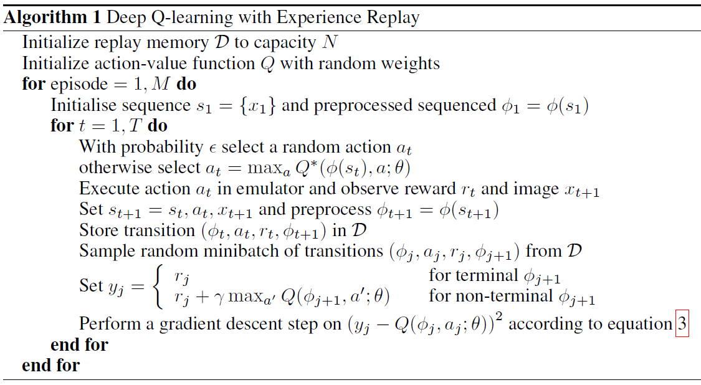

# 8. 1 금

개인 TODO
- 머리 자를 것
- 셔츠, 바지 (완료)
- 속옷상의 
- 카톡프사 (완료)
- 학원에 연락 (완료)

회사관련 TODO
- 가져올 것들
    - USB 가져오기 (완료)
    - 작은 멀티탭 (필요없음)
    - 건전지 AA (완료)
    - 안경닦이
- DQN 다시 공부
- ECM 프로그램 익히기
- 교육자료 학습
- 건강검진결과 재제출 (필요시-> 안내도 됨)

미팅(최훈영 수석님)
- 금일 4시 강인석 교수님 회의 관련
    - PNR 社의 데이터
    - 데이터에 대한 요구사항 -> 수석님이 대응
    - 시뮬레이션 -> cowork
    - 강화학습을 ECM에 탑재하는 것이 목적
- 교육자료 교육 (차주 중 하루)

D://onboardings(입사자료 : 교육자료, 문서 포맷, 업무보고 등)
- 신입 필수설치파일,양식확인
    - 교안
    - 발표 자료 템플릿
        - [발표및분석 포맷]기간_(업체)제목_담당자.pptx
    - 분석방법론모음
        - 6.비지니스사례모음.pptx
    - 업무보고 템플릿
    - 회사 서류 템플릿
- 최훈영수석님_인계자료
    - 202411_ECMiner를 활용한 빅데이터 분석 AI 교육
    - 기초자료
        - 분석과제 자료 샘플
        - 참고 분석 장표
        - ECMiner를 활용한 빅데이터 분석 AI 교육.pptx

명함 목록
- 신민수 주임님 / 컨설팅
- 고수연 주임님 / 컨설팅 / 바로 옆자리
- 최훈영 수석님 / 컨설팅 / 오늘 미팅
- 박진윤 주임님 / 컨설팅 / 뒤 오른쪽1
- 조연서 주임님 / 컨설팅 / 뒤

인공지능 팀
- 연구소
    - 김범곤 책임님
    - 이송화 주임님
- 컨설팅부문
    - 최훈영 수석님
    - 권경원 주임님
    - 조연서 주임님

# 8. 4 월

working hours
- 회의 : 2h
    - 아침미팅 (대표님)
    - 업무분장 회의 (대표님, AI팀)
    - 조연서 주임님 회의
    - 서부발전 과제 개요 (본부장님, 조주임님, 보름주임님 등)
- 강화학습 공부 : 6h
  - DQN 논문 이해 : 1차 완료
  - DDPG 논문 : 조금만 보았음 
  - TD, SARSA, Q-learing 등 : sutton의 책 조금 보았음.
  - MDP, bellman equation : Sutton의 책을 보고 필기도 조금 했음.

아침미팅 (잠깐)
- 참석 : 대표님, 이본부장님, 박본부장님(잠깐)
- 금요일 회식 이후 / 일요일 카톡
- 김성범 교수님 강의 -> 오승상 교수님
- 김범곤 책임님 : 시뮬레이션과 테스트
- 조연서 주임님 : 파이썬 코드 수령하여 맡아서 진행
- 대상 domain : PNR, 서부발전
- code documentation (교재 파트)
    - Q-learning, DQN, DDPG 등
    - 동일한 예제가 수록되어 있는 오류 있음.

업무분장 (대표님)
- 연구소
    - RL algorithm -> review : 개선 필요
    - 사용법 관련
        - 교재 -> 재구성 필요
        - 예재 -> 재구성 필요
- 컨설팅
    - 서부발전, 포스코 PNR
    - 문제 정의 -> 나, 김범곤 책임님, 최수석님 : RL simulation에 투입될 것

기타
- documentation 관련
    - 이론 소개, pseudo-code, class 등 정의
- 최상무님 : Q learning의 미로찾기 -> 9월 이후에 하는 것으로.
    - 강교수님의 코드
- 7개의 신규 코드

DQN 공부 : 모두 이해한 것으로 생각됨
- pseudo-code
    
- [블로그 포스트](https://ai-com.tistory.com/entry/RL-%EA%B0%95%ED%99%94%ED%95%99%EC%8A%B5-%EC%95%8C%EA%B3%A0%EB%A6%AC%EC%A6%98-1-DQN-Deep-Q-Network)
    - CNN architecture
        - 해당 논문이 atari 게임 문제를 다루고 있으므로 CNN이 사용됨.
        - 하지만 일반적으로 CNN이 사용될 이유는 없을듯.
    - experience replay
    - target network
- claude와의 대화
    - DQN의 목적은 결국 Q function을 근사하는 것이 맞는지?
        - 맞음.
        - DQN에서는 신경망을 사용하여 Q function을 근사하게 됨.
    - y_j의 의미
        - pseudo-code에서 y_j는 true value(타겟 값)을 의미함.
        - 이것은 결국 bellman equation에서 유도될 수 있는 Q의 추정치임.
        - 하지만 진정한 의미에서의 참값이라고 볼 수는 없으므로 이 과정에서 부스트래핑이 일어났다고 봐야 함.
            - 부스트래핑 : 자기 자신의 추정치를 이용하여 자기 자신을 업데이트 하는 것.
    - $\max_{a'}Q(\phi_{j+1},a';\theta)$의 의미?
        - 주어진 next state $phi_{j+1}$에 대하여 $\theta$로 매개변수화된 network에 모든 $\phi_{j+1},a'$ pair를 넣어서 그 중 최댓값을 얻고 그것을 y_j로 둔다.
    - DQN은 on-policy이다.
        - on-policy란 policy에 dependent하게 학습해나가는 것을 의미한다.
        - full trajectory를 다 가는 것. 이전 경험을 바탕으로 정책을 만들고, 그 정책으로 다음 스텝을 진행하고, 또 그 경험을 정책에 반영하는 식이다.
        - 따라서 on-policy 학습의 문제점 중 하나는, 잘못 진행되었을 경우에 편향된 결과가 나올 수 있다는 것. 한 번 방향이 틀어지면, 바람직한 방향과는 다른 방향으로 계속 나아갈 수 있다.
    - replay buffer와 미니배치, y_j
        - pseudo-code를 보면 replay buffer에서 transition들의 미니배치를 추출해서 그걸 가지고 y_j (Q function의 임시 참값)을 정의하고 그걸 가지고 y_j와 Q 사이의 차이를 최소화하는 경사하강법을 진행한다.
        - 따라서 이때의 y_j는 하나의 값이 아니라 여러 개(미니배치의 샘플 갯수)의 값이다. 경사하강법 시 쓰이는 loss는 여러 개의 j에 대해 MSE를 계산하여 진행하는 것.

temporal difference : 6.1 TD prediction (sutton)
- Monte Carlo method (constant-$\alpha$)
    $$V(S_t)\leftarrow V(S_t)+\alpha\left[G_t-V(S_t)\right]$$
- TD(0)
    $$
    \begin{align*}
    V(S_t)&\leftarrow V(S_t)+\alpha\left[R_{t+1}+\gamma V(S_{t+1})-V(S_t)\right]\\
    V(S_t)&\leftarrow(1-\alpha)V(S_t)+\alpha\left[R_{t+1}+\gamma V(S_{t+1})\right]\\
    \end{align*}
    $$
- Monte Carlo는 episode가 모두 끝난 후에 그 return을 바탕으로 업데이트하고 TD는 매 스텝마다 즉시 업데이트.
- TD는 한 스텝의 reward+추정치를 사용하므로 boostrapping에 해당함.

SARSA, Q-learning
- 6.4 Sarsa: On-Policy TD Control (sutton)
  $$Q(S_t,A_t)\leftarrow Q(S_t,A_t)+\alpha\left[R_{t+1}+\gamma Q(S_{t+1},A_{t+1})-Q(S_t,A_t)\right]$$
    - on policy TD control 알고리즘
    - boostrapping
- 6.5 Q-Learning: Off-Policy TD Control
  $$Q(S_t,A_t)\leftarrow Q(S_t,A_t)+\alpha\left[R_{t+1}+\gamma\max_a Q(S_{t+1},a)-Q(S_t,A_t)\right]$$
    > Sarsa and actor critic methods are on-policy methods, and Q-learning and R-learning are off-policy methods.
    > In the next few chapters we extend these algorithms, making them slightly more complicated and significantly more powerful. All the new algorithms will retain the essence of those introduced here: they will be able to process experience **on-line**, with relatively little computation, and they will be driven by TD errors. The special cases of TD methods introduced in the present chapter should rightly be called one-step, tabular, **modelfree** TD methods. In the next three chapters we extend them to multistep forms (a link to Monte Carlo methods), forms using function approximation rather than tables (a link to articial neural networks), and forms that include a model of the environment (a link to planning and dynamic programming).
- online/offline
    - online : 환경과 상호작용하며 학습
    - offline : 상호작용 없이 학습
    - SARSA, Q-learing, DQN은 모두 online 학습에 해당한다.
- model free
    - model free : 환경의 dynamics(전이확률, 보상함수)를 명시적으로 학습하지 않고, 직접 value function이나 policy를 학습하는 방법

    ```
    # (1) model free
    # 환경 모델 없이 직접 Q값 학습
    Q(s,a) ← Q(s,a) + α[r + γmax Q(s',a') - Q(s,a)]
    # 실제 경험한 (s,a,r,s')만 사용

    # (2) not model free
    # 1단계: 환경 모델 학습
    P(s'|s,a) ← count(s,a,s') / count(s,a)
    R(s,a) ← average_reward(s,a)
    
    # 2단계: 모델로 planning
    for i in range(planning_steps):
        s' = sample_from_P(s,a)
        r = R(s,a)
        Q(s,a) ← Q(s,a) + α[r + γmax Q(s',a') - Q(s,a)]
    ```

# 8. 5 화

working hours
- 회의 : 2h
  - RL 인수인계 등 (조주임님)
  - 업무분장 전체 회의 (이상빈 본부장님)
  - RL 업무방향 회의 (본부장님, 최수석님)
- 연구노트 작성 : 5h
  - MDP
  - 가치함수, bellman equation
  - policy iteration (DP), generalized policy iteration
  - temporal difference
  - SARSA, Q-learning
  - (예정) DQN
- ECM 학습 : 1h

DDPG 업무 계획
- DDPG 알고리즘 파악
  - 관련 개념에 대한 개략적 이해
    - policy gradient
    - actor critic 구조
  - pseudo code 및 전체 알고리즘 이해
- 탐색적 데이터 분석 
- DDPG 공정 제어 case study (OPTIONAL)
  - reinforcement learning (DDPG) on process control
- python DDPG 코드 작성
  - reference code 찾기 (brute-force 형식의 코드)
  - 코드 작성
- 수령한 일주일치 데이터에 실험 적용(시뮬레이션)
  - 최초 실험
  - 주요 hyperparameter 및 세팅을 변경하며 실험
- 상태변수 결정
  - state 조합을 바꿔가며 실험
- 환경모델 결정 (OPTIONAL)
  - 현행 선형 모델(PLS)과 비선형모델(e.g. NN)과 비교


# 8. 6 수

working hours
- 연구노트 : 환경 적용문제 (DQN, DDPG → ECM) - 0.5h
- Q learning 파이썬 코드 작성, 디버깅, 테스트 - 3h
- 이송화 선임, 공보름 주임님 미팅 - 2h
- 연구노트 : Q-learning 예제 파이썬 코드 구현 - 0.5h
- 파이썬 gymnasium에서의 step 메소드 분석 - 1h
- 연구노트, 메일 : 강화학습을 구현하기 위한 환경모델의 필요성 - 1h

# 8. 7 목
working hours
- 메일 (김범곤 책임 -> 이송화 선임) 열람 및 검토
  - SARSA에는 replay buffer가 없는데 replay buffer가 나오는 이유를 모르겠다. 즉 SARSA는 대표적인 on-policy 알고리즘이고 replay buffer는 off-policy 알고리즘에 적용되는데 왜 replay buffer 이야기가 나오는지.
  - 강화학습에서 '목표변수', '제어변수'라는 말이 일반적으로 쓰이는지 모르겠다.
  - '환경모델 기반 강화학습'이 의미하는게 model based라면, 그렇지 않다. SARSA는 model free algorithm이다.
- 

# 8. 8 금
working hours
- SARSA 및 Q-learning 복습 - 0.5h
- 회의 및 분식집 (w/ 대표님, 최숙 상무님, 최훈영 수석님, 이송화 선임님, 공보름 주임님) - 3h
- 주간업무 보고 작성 등 - 1h
- 컨설팅 팀 회의 - 1h
  - 서부발전 도메인 지식 추가 전달 (w/최수석님)
  - EDA 추가 업무분장 배정 (이본부장님, w/권경원주임님)
  - 현대제철 강화학습 관련 (w/이본부장님, 최수석님)
- 강인석교수님 회의 (w/강인석 교수님, 최수석님, 공주임님)

# 8. 11 월

feature extraction
GL차트 1 (합성가스 압력 ~ 압축기 입구 온도)
- 양의 상관관계가 서로 높은 feature 목록
  - 합성가스 유량
  - 연료제어밸브(VSR-11) 개도
  - 연료기 주입 전 연료 압력
  - 발전기 출력 → 이 feature군에 대한 대표 feature로 지정해도 될듯
  - 압축기 필터 차압
- 다른 feature들과 상관관계가 없어보이는 feature
  - 1차 제어 후 연료 압력 P2 구역

GL 차트 2 (대기 압력 ~ 질소가스 내 산소 순도)
- 발전기 출력과 양의 상관관계가 높은 feature 목록
  - IGV 개도
  - 가스터빈 압축기 출구 압력
  - 가스터빈 압축기 출구 온도
- 다른 feature들과 상관관계가 없어보이는 feature
  - 가스터빈 속도(rpm)
  - DGAN Compressor 질소가스 온도

feature selection
- 목표변수와 상관관계가 없는 feature 제외
  - 1차 제어 후 연료 압력 P2 구역
  - 가스터빈 속도(rpm)
  - DGAN Compressor 질소가스 온도
- 서로 연관관계가 깊은 feature 그룹에 대해서는 하나의 feature (발전기 출력)으로 치환
  - 합성가스 유량
  - 연료제어밸브(VSR-11) 개도
  - 연료기 주입 전 연료 압력
  - 압축기 필터 차압
  - IGV 개도
  - 가스터빈 압축기 출구 압력
  - 가스터빈 압축기 출구 온도
- 시간 및 순번 feature는 제외
  - 10초구간
  - G_CNT

selected feature (8개), action and rewards
- 합성가스 압력
- 합성가스 온도
- 합성가스 발열량(계산값)
- 발전기 출력
- 압축기 입구 온도
- 대기 압력
- 대기 온도
- 질소가스 내 산소 순도
- DGAN compressor 질소가스 유량  ← action
- 가스터빈 후단 질소산화물 농도 ← reward

selected features 요약
- F1-3 : 합성가스 압력, 온도, 발열량
- F4 : 발전기 출력
- F5 : 압축기 입구 온도
- F6-7 : 대기 압력과 온도
- F8 : 질소가스 내 산소 순도

